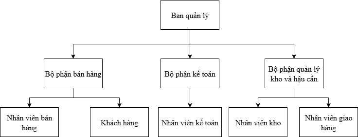
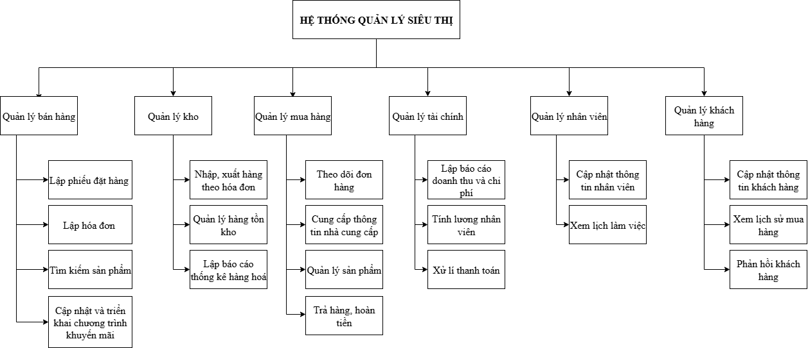
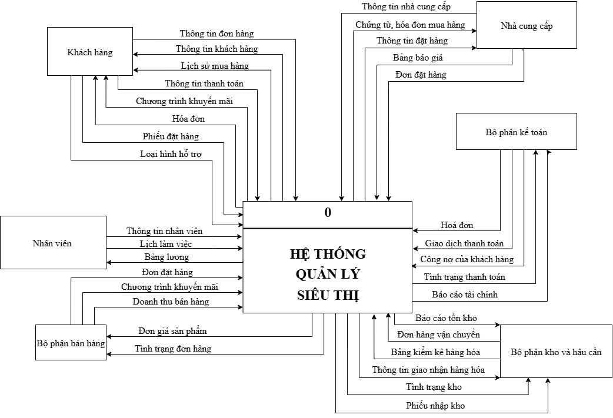
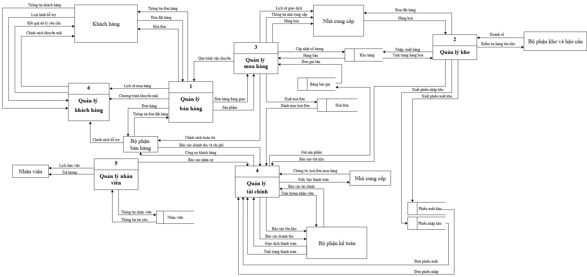
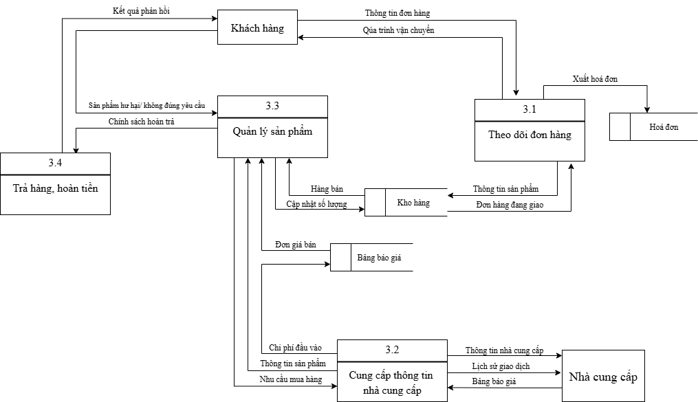
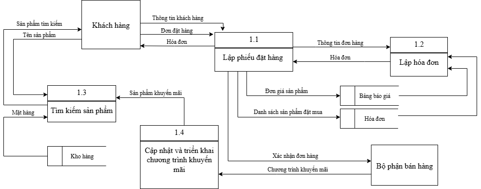
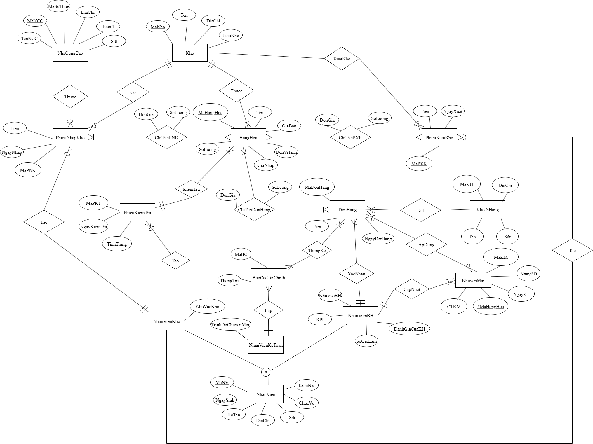

# Supermarket Management System – System Analysis and Design Project

## 📌 Overview
This project is a **System Analysis and Design** assignment with the topic **Supermarket Management System**.  
The report focuses on analyzing user requirements, defining business processes, and designing a system to support supermarket operations, including **sales, warehouse management, logistics, and accounting**.

---

## 🏗 System Structure
The system is divided into main functional departments:
- **Sales Department** – Handles customer transactions and order processing.  
- **Warehouse & Logistics Department** – Manages inventory, imports, and product storage.  
- **Accounting Department** – Tracks financial data, invoices, and payments.  

---

## 🔎 Project Scope & Tasks
The project involves the following key steps:

1. **Requirement Analysis**  
During the requirement analysis phase, we collected and consolidated the needs of both customers and bookstore staff through interviews, surveys, and workflow observations. The process helped us identify the essential business operations, related departments, and their interactions with the system.
This comprehensive requirement analysis provided the foundation for designing system workflows, data flow diagrams (DFDs), and the database structure.

3. **System Rules Definition**  
Established regulations and operational rules for the system.  

4. **Business Requirements Specification**  
We identified and analyzed the core business processes for each department, ensuring that the system design aligns with operational needs. The requirements were described in a summarized form, accompanied by relevant forms and regulatory documents.

6. **Business Process Description**  
In this section, we provide a detailed analysis of the main business processes within the system.  
The team identified and documented workflows related to **Sales**, **Customer Service**, **Internal Operations**, and **Product Importing**.  

Each process was analyzed step by step to ensure clarity and to define how the system supports the workflow.  
Additionally, we designed **Use Case Diagrams** and described specific **Use Cases** for some of processes, such as:  
- Create an order form
- Track order
- Inventory tracking
- Employee salary calculation
- Prepare a report on revenue and expenses...

This section serves as a foundation for system design and implementation by bridging business requirements with technical development.

7. **System Analysis**  
   - Created diagrams to model the system:
     - **Organizational chart**:

     - **BFD** (Business Function Diagram)

     - **DFD** (Data Flow Diagram)

     - **ERD** (Entity-Relationship Diagram)  

8. **System Design**  
   - Designed the database structure and detailed table schema.  
   - Proposed user interface prototypes for system interaction.  

---

## 🛠 Tools & Techniques
- **Modeling diagrams:** DFD, BFD, ERD using *Draw.io*  
- **Database design:** Entity-Relationship modeling, schema design  
- **UI/UX design:** Interface mockups for system modules  

---

## 🎯 Outcome
The essay achieved a basic level of practical relevance, addressing the topic at a general scope. However, the analysis remains limited in depth and has not yet reached a level where it can be effectively applied in real-world practice. This highlights the need for further research and development to strengthen both theoretical foundations and practical applicability.

See more in [Report](SupermarketManagementSystem_Report.pdf)
